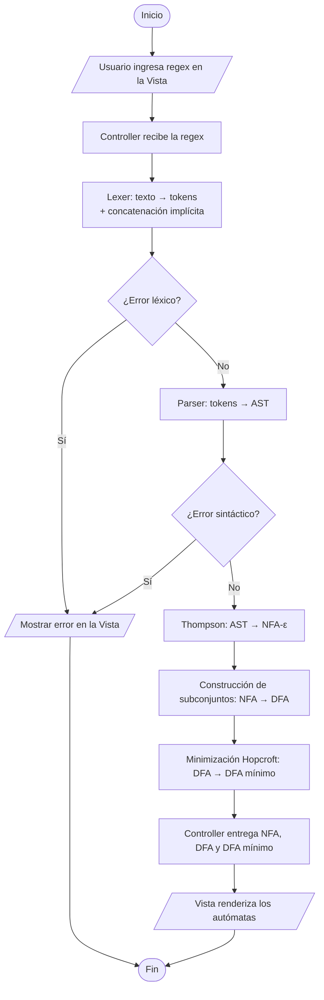

# 0. Pipeline general

Flujo completo desde la expresión regular hasta su visualización (arquitectura MVC + pipeline).

```mermaid
flowchart TD
    A([Inicio]) --> B[/Usuario ingresa regex en la Vista/]
    B --> C[Controller recibe la regex]
    C --> D[Lexer: texto → tokens<br/>+ concatenación implícita]
    D --> E{¿Error léxico?}
    E -- Sí --> X[/Mostrar error en la Vista/]
    E -- No --> F[Parser: tokens → AST]
    F --> G{¿Error sintáctico?}
    G -- Sí --> X
    G -- No --> H[Thompson: AST → NFA-ε]
    H --> I[Construcción de subconjuntos: NFA → DFA]
    I --> J[Minimización Hopcroft: DFA → DFA mínimo]
    J --> K[Controller entrega NFA, DFA y DFA mínimo]
    K --> L[/Vista renderiza los autómatas/]
    L --> M([Fin])
    X --> M
```
