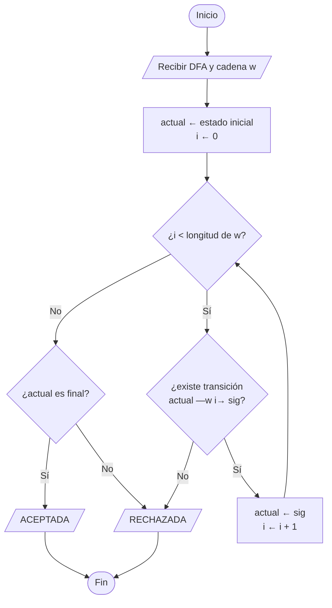

# 6. Simulación del DFA (validar una cadena)

Sirve para probar el resultado y para animar el recorrido en la vista.

```mermaid
flowchart TD
    A([Inicio]) --> B[/Recibir DFA y cadena w/]
    B --> C[actual ← estado inicial<br/>i ← 0]
    C --> D{¿i < longitud de w?}
    D -- No --> H{¿actual es final?}
    H -- Sí --> ACC[/ACEPTADA/]
    H -- No --> REJ[/RECHAZADA/]
    D -- Sí --> E{¿existe transición<br/>actual —w i→ sig?}
    E -- No --> REJ
    E -- Sí --> F[actual ← sig<br/>i ← i + 1]
    F --> D
    ACC --> Z([Fin])
    REJ --> Z
```
